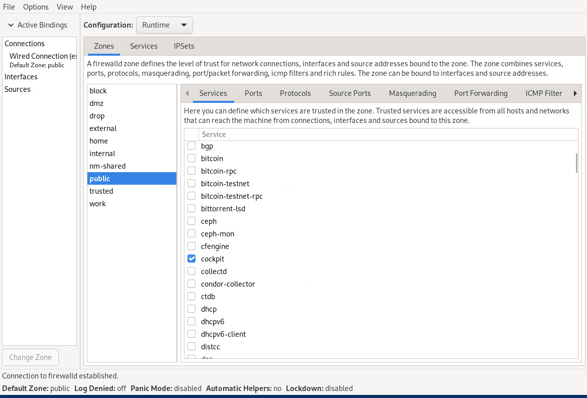

<!--
SPDX-FileCopyrightText: 2023,2024 Oracle and/or its affiliates.
SPDX-License-Identifier: CC-BY-SA-4.0
-->

# 패킷 필터링 방화벽 구성

이 장에서는 패킷 필터링을 사용하여 방화벽을 구성하는 개념, 도구 및 방법에 대해 설명합니다. 또한 시스템에 네트워크 보안을 적용하는 방화벽 설정을 표시하는 예도 제공합니다.

## 패킷 필터링 방화벽 정보

방화벽은 패킷 헤더 정보를 기반으로 들어오고 나가는 네트워크 패킷을 필터링합니다. 패킷이 허용되는지 또는 거부되는지를 감지하는 패킷 필터 규칙을 생성합니다. 포트를 차단하는 규칙을 생성하면 해당 포트에 대한 모든 요청이 방화벽에 의해 거부되고 해당 요청도 무시됩니다. 차단된 포트에서 수신 대기 중인 모든 서비스는 사실상 비활성화됩니다.

Enterprise Linux 커널은 Netfilter 기능을 사용하여 IPv4 및 IPv6 패킷에 대한 패킷 필터링 기능을 제공합니다.

Netfilter는 두 가지 구성 요소로 구성됩니다.:

- 커널이 네트워크 패킷 필터링을 제어하는​데 사용하는 규칙에 대한 메모리 테이블 세트로 구성된 'netfilter' 커널 구성 요소입니다.

- 'netfilter'가 저장하는 규칙을 생성, 유지 및 표시하는 유틸리티입니다. Enterprise Linux 9에서 기본 방화벽 유틸리티는 'firewalld' 패키지에서 제공하는 'firewall-cmd'입니다.

`firewalld` 기반 방화벽은 다음과 같은 장점이 있습니다.:

- `firewalld-cmd` 유틸리티는 방화벽을 다시 시작하지 않고 설정된 TCP 연결을 중단하지 않습니다.

- 'firewalld'는 동적 Zone을 지원하므로 다양한 신뢰 수준으로 네트워크에 연결할 수 있는 랩톱과 같은 시스템에 대해 다양한 방화벽 규칙 세트를 구현할 수 있습니다. 그러나 이 기능은 일반적으로 서버 시스템에서 사용되지 않습니다.

- 'firewalld'는 방화벽 구성에 의존하는 서비스와의 더 나은 통합을 위해 D-Bus를 지원합니다.

## 방화벽 구성 도구

다음 도구 중 하나를 사용하여 방화벽을 구성할 수 있습니다.:

- `firewall-cmd` 명령과 여러 옵션을 사용합니다.

- 방화벽 구성 GUI를 사용하여

  이 도구를 사용하려면 먼저 `firewall-config` 패키지를 설치한 다음 패키지 이름과 동일한 명령을 사용하여 시작해야 합니다. 예를 들어:

  ```
  sudo dnf install firewall-config
  ```

  ```
  sudo firewall-config &
  ```

  이 명령은 다음 그림과 같이 구성 도구를 엽니다.:

  

- Cockpit은 방화벽 구성을 수행하는 데 사용할 수도 있는 브라우저 기반 구성 도구입니다.

## 방화벽 서비스 제어

Enterprise Linux 9에서는 방화벽 서비스 'firewalld'가 기본적으로 활성화됩니다. 서비스는 `systemctl` 명령으로 제어됩니다.

서비스를 시작하려면:

```
sudo systemctl unmask firewalld
```

```
sudo systemctl start firewalld
```

시스템이 시작될 때 서비스가 자동으로 시작되도록 하려면 방화벽을 시작한 후 다음 명령을 실행하십시오.:

```
sudo systemctl enable firewalld
```

방화벽 서비스를 중지하고 시스템 시작 시 자동으로 시작되지 않도록 하려면 다음 명령을 실행합니다.:

```
sudo systemctl stop firewalld
```

```
sudo systemctl disable firewalld
```

방화벽 서비스가 다른 서비스나 'firewalld' D-Bus 인터페이스를 통해 시작되는 것을 방지하려면 방화벽을 비활성화한 후 다음 명령을 실행하세요.:

```
sudo systemctl mask firewalld
```

방화벽 서비스의 현재 상태를 표시하려면:

```
sudo systemctl status firewalld
```

```
firewalld.service - firewalld - dynamic firewall daemon
     Loaded: loaded (/usr/lib/systemd/system/firewalld.service; enabled; vendor preset: enabled)
     Active: active (running) since Thu 2022-05-05 08:41:36 GMT; 5 days ago
       Docs: man:firewalld(1)
   Main PID: 1155 (firewalld)
      Tasks: 4 (limit: 93659)
     Memory: 32.5M
        CPU: 1.438s
     CGroup: /system.slice/firewalld.service
             └─1155 /usr/bin/python3 -s /usr/sbin/firewalld --nofork --nopid
```

## Zones 과 Services

방화벽 보안은 Zone과 Service의 개념을 통해 구현됩니다.

Zone은 네트워크 액세스에 대한 신뢰 수준에 해당하는 사전 정의된 필터링 규칙 세트입니다. Zone 설정을 재구성하여 Zone의 기본 필터링 규칙에 추가할 수 있으므로 해당 Zone의 트래픽 흐름 제어를 구체화할 수 있습니다. Enterprise Linux를 설치하면 'public'이라는 기본 Zone이 시스템에 자동으로 할당됩니다.

방화벽 규칙은 Zone에 할당된 서비스를 통해 적용됩니다. 서비스 포트는 네트워크 트래픽의 액세스 지점입니다. Zone에 할당된 서비스는 네트워크 패킷을 수신하고 전송하기 위해 자동으로 해당 포트를 엽니다.

Zone 및 방화벽 관련 서비스에 대한 자세한 내용은 'firewalld.zone(5)' 및 'firewalld.service(5)' 매뉴얼 페이지를 참조하세요.

### Zone에 대한 정보 표시

Zone에 대한 방화벽을 구성할 때 구성 단계의 일부로 현재 Zone과 서비스 설정 및 기타 정보를 표시하는 것이 좋습니다. 이 접근 방식을 사용하면 방화벽에 적용되는 변경 사항을 모니터링하고 변경 사항을 유효하지 않게 만드는 잠재적인 오류를 식별할 수 있습니다.

시스템의 기본 Zone을 표시하려면 다음 명령을 실행하십시오.:

```
sudo firewall-cmd --get-default
```

다음과 같이 설치에 포함된 사전 정의된 Zone을 모두 나열하십시오.:

```
sudo firewall-cmd --get-zones
```

```
block dmz drop external home internal nm-shared public trusted work
```

You can configure any zone in the list. As you change settings of a particular zone, that zone becomes an active zone. To identify the active zone, type the following:

```
sudo firewall-cmd --get-active-zone
```

**Note:**

By default, all configurations are implemented on the default zone. Note also that an active zone isn't necessarily the default zone. Therefore, you must specify the zone name in the command to define settings for that specific zone. Otherwise, the definitions are applied to the default zone.

### Zone 설정 표시

Zone 설정을 정보를 얻으려면:

```
sudo firewall-cmd --list-all [--zone=*zonename*]
```

Without specifying a zone, the command displays the settings of the default zone. Thus, to list the settings of the `work` zone, you would use the following command;

```
sudo firewall-cmd --list-all --zone=work
```

```nocopybutton
work
  target: default
  icmp-block-inversion: no
  interfaces: 
  sources: 
  services: cockpit dhcpv6-client ssh
  ports: 
  protocols: 
  forward: yes
  masquerade: no
  forward-ports: 
  source-ports: 
  icmp-blocks: 
  rich rules: 
```

## 방화벽 Zone 구성

다음 작업에서는 `firewall-cmd` 명령을 사용하여 Zone에 대한 방화벽 규칙을 구성하는 방법을 설명합니다. 그런 다음 규칙은 `firewalld`에 대한 `/etc/firewalld` 계층 구조에 기록됩니다.

방화벽을 구성한다는 것은 방화벽이 사양에 따라 네트워크 트래픽을 제어할 수 있도록 Zone 설정 전체 또는 일부를 특정 값으로 설정하는 것을 의미합니다.

### 서비스에 대한 액세스 제어

Zone의 '서비스'를 설정하는 것이 방화벽을 구성하는 기본 방법입니다. 각 ZONE에는 미리 정의된 서비스가 할당되어 있습니다. 이 설정을 추가로 구성하려면 Zone에 서비스를 추가하거나 ZONE에서 서비스를 제거합니다.

사전 정의된 서비스를 나열하려면 'firewall-cmd --list-services' 명령을 사용하세요.

예를 들어, 다음 명령은 `work` ZONE에 `cockpit`, `dhcpv6-client` 및 `ssh` 서비스가 할당되어 있음을 보여줍니다.:

```
sudo firewall-cmd --list-services --zone=work
```

```nocopybutton
cockpit dhcpv6-client ssh
```

To open access to a new service, use the `--add-service` _service_ option. Optionally, include the `--permanent` option to make the rule persistent across reboots.

예를 들어 'work' Zone에 HTTP 및 NFS 서비스를 추가하려면 다음 명령을 사용합니다.:

```
sudo firewall-cmd --permanent --zone=work --add-service=http --add-service=nfs
sudo firewall-cmd --list-services --zone=work
```

```nocopybutton
cockpit dhcpv6-client ssh http nfs
```

서비스에 대한 액세스를 제거하려면 `--remove-service` _service_ 옵션을 사용하세요.:

```
sudo firewall-cmd --permanent --zone=work --remove-service=cockpit
sudo firewall-cmd --list-services --zone=work 
```

```nocopybutton
dhcpv6-client ssh http nfs
```

### 포트에 대한 액세스 제어

Zone 서비스를 통한 네트워크 트래픽은 해당 서비스의 포트를 사용합니다. 트래픽을 허용하려면 포트를 열어야 합니다. 포트 번호와 관련 프로토콜을 지정하여 네트워크 액세스를 위해 더 많은 포트를 열 수 있습니다.

`--list-ports` 옵션은 명시적으로 액세스를 허용한 포트 및 관련 프로토콜을 나열합니다. 그러나 서비스로 열린 포트는 이 명령의 출력에 포함되지 않습니다. 따라서 포트를 나열할 때 가장 좋은 방법은 '--list-all' 옵션을 사용하여 보다 완전한 정보를 얻는 것입니다.

특정 포트에 대한 액세스를 허용하려면 `--add-port` 옵션을 사용하세요. 포트는 _port-number_/_port-type_ 형식을 사용하여 지정해야 합니다. 포트 유형은 `tcp`, `udp`, `sctp` 또는 `dccp`일 수 있습니다. 예를 들어 유형과 네트워크 트래픽이 일치하는지 확인하십시오.:

```
sudo firewall-cmd --permanent --zone=work --add-port=5353/udp --add-port=3689/tcp
sudo firewall-cmd --list-all --zone=work 
```

```nocopybutton
work
  target: default
  icmp-clock-inversion: no
  interfaces:
  sources:
  services: dhcpv6-client ssh http nfs 
  ports: 5353/udp 3689/tcp
...
```

마찬가지로 `--remove-port` 옵션은 포트에 대한 액세스를 제거합니다. 변경 사항을 지속하려면 `--permanent` 옵션을 사용하는 것을 잊지 마세요.

자세한 내용은 `firewall-cmd(1)` 매뉴얼 페이지를 참조하세요.

### Zone에 네트워크 인터페이스 할당

시스템의 네트워크 인터페이스는 기본 Zone에 자동으로 할당됩니다. Enterprise Linux에서는 특정 서비스, 포트 등을 사용하여 여러 Zone을 구성할 수 있습니다. 그런 다음 해당 Zone에 인터페이스를 할당하여 특정 Zone의 규칙이 작동하도록 활성화합니다. 따라서 네트워크 인터페이스를 재할당하여 시스템에서 활성화된 방화벽 규칙을 쉽게 변경할 수 있는 유연성이 있습니다.

'작업' Zone의 방화벽 구성을 활성화한다고 가정해 보겠습니다. 다음과 같이 Zone에 인터페이스를 할당합니다.:

```
sudo firewall-cmd --zone=work --change-interface=enp0s1
sudo firewall-cmd --get-active-zone
```

```nocopybutton
work
  interfaces: enp0s1
```

**Note:**

재부팅 후에도 설정이 유지되도록 하려면 `--permanent` 옵션을 사용할 필요가 없습니다. [기본 Zone 변경](firewall-ConfiguringaPacketFilteringFirewall.md)에 설명된 대로 해당 Zone을 기본 Zone으로 설정하면

### 기본 Zone 변경

다음과 같이 시스템의 기본 Zone을 변경할 수 있습니다.:

```
sudo firewall-cmd --set-default-zone=work
```

변경 사항이 적용되었는지 확인할 수도 있습니다.:

```
sudo firewall-cmd --get-default-zone
```

구성의 전체 및 최종 결과를 표시하려면:

```
sudo firewall-cmd --zone=work --list-all
```

```nocopybutton
work (active)
  target: default
  interfaces:  enp0s1
  sources:
  services: dhcpv6-client ssh http nfs
  ports: 5353/udp 3689/tcp
...
```

### 들어오는 트래픽 제어를 위한 기본 규칙 설정

'대상' 설정은 들어오는 트래픽을 관리할 때 방화벽의 기본 동작을 설정합니다. 이 Zone 설정은 사전 정의된 모든 Zone에 대해 '기본값'으로 자동 구성됩니다. Zone의 기본 동작을 변경하려면 다음 명령을 사용하십시오.;

```
sudo firewall-cmd --zone=*zone-name* --set-target=ACCEPT|REJECT|DROP
```

다음 옵션을 지정할 수 있습니다.:

- `ACCEPT` 다른 규칙에서 거부되도록 설정한 트래픽을 제외한 모든 수신 트래픽을 허용합니다.

- `REJECT` blocks all incoming traffic except those you have allowed in another rule. The source machine is informed about the rejecion.

- `DROP`은 `REJECT`와 유사하지만 거부 알림이 원본 시스템으로 전송되지 않습니다.

### 소스를 기준으로 들어오는 트래픽 관리

You can manage incoming traffic to a zone based on the traffic source. The two following two zone settings enable you to specify the origin of the packets:

- `source` 송신 노드 또는 네트워크를 식별합니다.

- `source-ports` 트래픽이 발생하는 포트를 식별합니다.

송신 노드에서 들어오는 트래픽을 수락하려면 다음 명령을 사용하십시오.:

```
sudo firewall-cmd --zone=*zone-name* --add-source=*IP-address*                  
```

IP 주소에는 '192.0.2.0/24'와 같이 CIDR 표기법으로 넷마스크가 포함될 수 있습니다.

현재 런타임 규칙 세트를 영구 규칙 세트로 변환하려면 다음 명령을 실행하십시오.:

```
sudo firewall-cmd --runtime-to-permanent
```

시스템이 재부팅되면 삭제되는 임시 구성을 설정하는 경우 이 명령을 생략하십시오.

The following similar syntax is used to set the `source-port` setting. However, you identify the source port by specifying the sending port number and the protocol type, for example:

```
sudo firewall-cmd --zone=*zone-name* --add-source-ports=*port-number*/tcp|udp|sctp|dccp
```

다양한 설정을 결합하여 방화벽을 구성할 수 있습니다. 다음 예와 같이 '192.0.2.0' 네트워크 소스의 HTTP 트래픽을 허용하도록 '신뢰할 수 있는' Zone을 구성할 수 있습니다.:

```
sudo firewall-cmd --zone=trusted --add-source=192.0.2.0/24
sudo firewall-cmd --zone=trusted --add-service=http
sudo firewall-cmd --zone=trusted --list-all
```

```nocopybutton
trusted (active)
  target: ACCEPT
  sources: 192.0.2.0/24
  services: http
```

## 방화벽 구현을 위한 맞춤형 Zone 생성

Zone을 생성한 다음 사용자 정의된 방화벽 보호를 위해 Zone 설정을 구성할 수 있습니다.

### Firewall-cmd 명령 사용

다음 예와 같이 'firewall-cmd' CLI를 사용하여 빈 Zone을 생성할 수 있습니다. 즉, 기본 서비스가 할당되지 않습니다. 사용자 정의 Zone을 구성할 때 명령에 항상 `--permanent` 옵션을 포함해야 합니다. 그렇지 않으면 오류 메시지가 생성됩니다.

```
sudo firewall-cmd --permanent --new-zone=testzone
sudo firewall-cmd --permanent --get-zones
```

```nocopybutton
block dmz drop external home internal nm-shared public testzone trusted work
```

```
sudo firewall-cmd --permanent --info-zone=testzone
```

```nocopybutton
testzone
  target: default
  icmp-block-inversion: no
  interfaces:
  sources:
  services:
  ports:
  protocols:
  masquerade: no
  forward-ports:
  source-ports:
  icmp-blocks:
  rich rules:

```

`--permanent` 옵션이 없으면 `--get-zones` 옵션은 생성된 Zone을 표시하지 않습니다.

`--info-zone=*zone-name*` 옵션은 `--list-all` 옵션과 동일한 출력을 생성합니다.

이 Zone 생성을 지속적으로 만들려면 다음 명령을 추가하세요.:

```
sudo firewall-cmd --runtime-to-permanent
```

Zone을 생성한 후 이전 예제에 제공된 명령 옵션을 사용하여 서비스, 포트 추가, 인터페이스 할당 등을 수행할 수 있습니다.:

```
sudo firewall-cmd --zone=testzone --add-service=http
```

```nocopybutton
Error: INVALID ZONE: testzone
```

```
sudo firewall-cmd --permanent --zone=testzone --add-service=http
```

이러한 명령을 사용할 때는 `--permanent` 옵션을 사용해야 합니다.

### Zone 구성 파일 사용

모든 Zone에는 해당 구성 파일이 있습니다. 운영 체제와 함께 설치된 사전 정의된 Zone의 경우 구성 파일은 `/usr/lib/firewalld/zones` 디렉토리에 있습니다.

사전 정의된 Zone을 구성하면 구성 파일이 `/etc/firewalld/zones` 디렉터리에 복사되고 변경 사항이 해당 위치에 저장됩니다. 구성 파일을 사용하여 새 Zone을 생성하는 경우 '/etc/firewalld/zones'도 작업 디렉터리로 사용해야 합니다.

미리 정의된 Zone의 설정과 약간만 다른 Zone을 생성하는 경우 기존 구성 파일을 작업 디렉터리에 복사하는 것이 가장 쉬운 방법입니다. You can use either of the following commands:

```
sudo cp /etc/firewalld/zones/*existing-conf-file*.xml *new-zone*.xml
```

```
sudo cp /usr/lib/firewalld/zones/*existing-conf-file*.xml /etc/firewalld/zones/*new-zone*.xml
```

Then, using a text editor, revise the settings in the new configuration file. The following example shows what the configuration file of `testzone` might contain. `testzone` accepts traffic for one service \(SSH\) and one port range for the TCP and UDP protocols:

```
<?xml version="1.0" encoding="utf-8"?>
<zone>
  <short>testzone</short>
  <description>*Put description here*</description>
    <service name="ssh"/>
    <port port="1025-65535" protocol="tcp"/>
    <port port="1025-65535" protocol="udp"/>
</zone>
   
```

